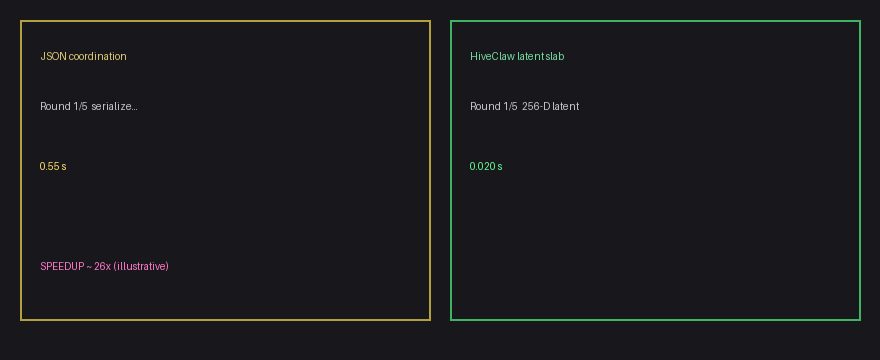
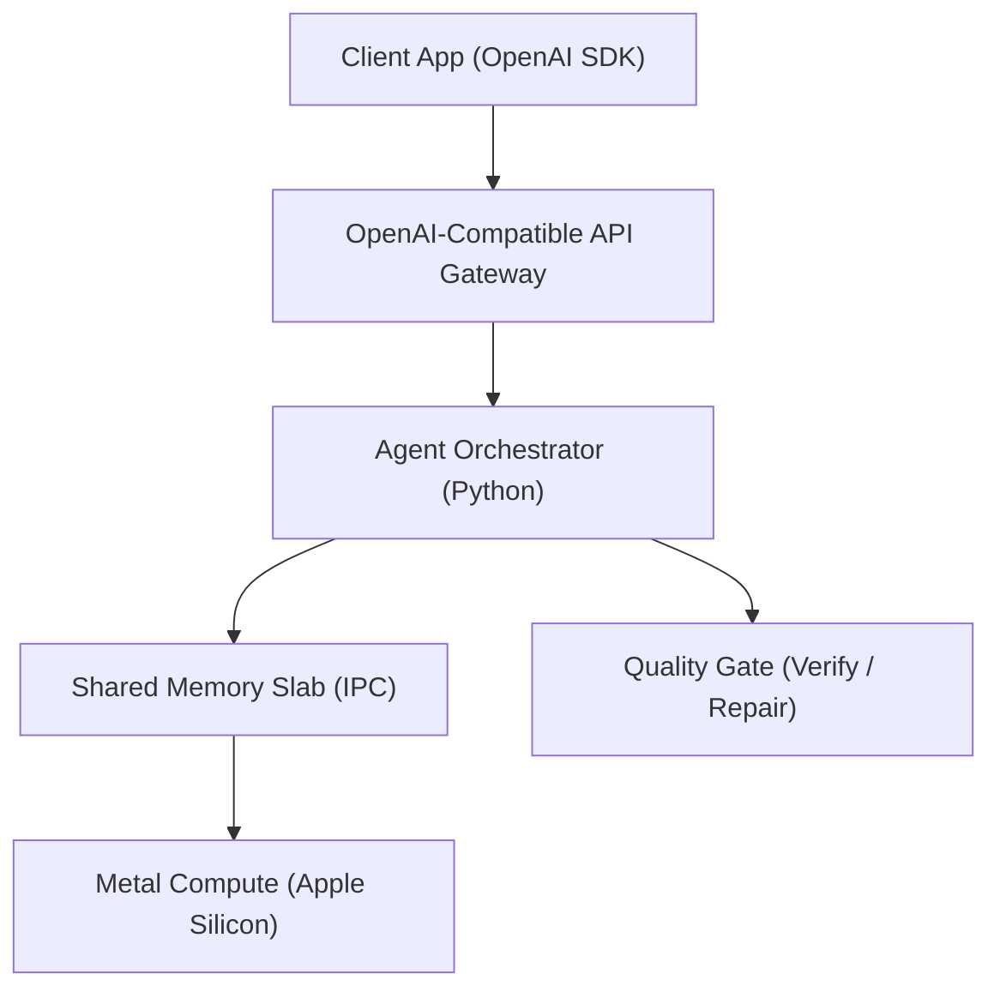

# HiveClaw

**Local, hardware-native inference with an OpenAI-compatible API** — run Llama-class models on Apple Silicon without shipping prompts or coordination state to a cloud provider. Multi-agent workflows share state through **inter-process communication** and **shared-memory orchestration** instead of ever-growing chat transcripts.



> Multi-agent coordination without the **token tax** of shipping full JSON transcripts every round — data stays on device. *Illustrative animation; run [`examples/hiveclaw_top.py`](examples/hiveclaw_top.py) for a live terminal demo.*

[](https://www.gnu.org/licenses/agpl-3.0)
[](https://github.com/wijeratne-a/HiveClaw/actions/workflows/wheel-macos-arm64.yml)
[](https://github.com/wijeratne-a/HiveClaw/actions/workflows/ironclad-burn-in.yml)

## Install

**PyPI (Python package name matches [`crates/hiveclaw-python/pyproject.toml`](crates/hiveclaw-python/pyproject.toml)):**

```bash
pip install hiveclaw_python
```

**From a checkout (contributors, or when you need the daemon + native extensions built from this tree):**

```bash
pip install -e crates/hiveclaw-python
```

Run **`make python`** first so the PyO3/MLX extensions exist; full macOS setup is in [`scripts/README.md`](scripts/README.md).

## Start here

**Checkout prerequisite:** Scripts under [`examples/`](examples/) import `hiveclaw_python`. After cloning, create a venv, then run **`pip install -e crates/hiveclaw-python`** and **`make python`** (same order as in **Install** above). If you skip this, you will get `ModuleNotFoundError: No module named 'hiveclaw_python'`. PyPI-only installs (`pip install hiveclaw_python`) already expose the package, but full Metal/daemon workflows still follow [`scripts/README.md`](scripts/README.md).

1. [`examples/hello_swarm.py`](examples/hello_swarm.py) — first `LocalSwarm` run (+ optional `--slab-only`).
2. [`examples/hiveclaw_top.py`](examples/hiveclaw_top.py) — side-by-side JSON vs latent slab timing (`--mock-only` for capture). Same behavior: [`examples/speed_test_viz.py`](examples/speed_test_viz.py).
3. **OpenAI SDK** — set `base_url` to the local gateway (snippet in the next section).

## Drop-in API (OpenAI SDK)

Point any OpenAI SDK client at the local server. Swap `base_url` — no other code changes.

```python
from openai import OpenAI

client = OpenAI(base_url="http://127.0.0.1:8080/v1", api_key="local")
resp = client.chat.completions.create(
    model="hiveclaw-llama-1b",
    messages=[{"role": "user", "content": "Summarize this contract."}],
)
print(resp.choices[0].message.content)
```

Run the gateway with **`hiveclaw-server`** or **`python -m hiveclaw_python.server_main`** (implementation: [`hiveclaw_python.openai_server`](crates/hiveclaw-python/python/hiveclaw_python/openai_server.py); `scripts/hiveclaw_server.py` is a thin compatibility shim).

### Targeted OpenAI API compatibility

HiveClaw implements a **subset** of the OpenAI Chat Completions API — enough for common SDK clients, not a full vendor parity surface.

| Feature | Status | Notes |
|---------|--------|-------|
| `POST /v1/chat/completions` | Yes | Primary endpoint |
| System / user / assistant messages | Yes | String `content` per message |
| `max_tokens`, `temperature`, `stream` | Yes | See server request model |
| SSE streaming (`stream=true`) | Yes | Final chunk includes `usage` (non-batch + continuous batch) |
| `GET /v1/models` | Yes | Lists `hiveclaw-llama-1b` and `HIVECLAW_CURSOR_MODEL_ALIAS` (default `hiveclaw-swarm-8b`) |
| Function calling / `tools` | No | Planned |
| JSON mode / `response_format` | No | Planned |
| `POST /v1/embeddings` | No | Out of scope for Phase 1 |

**Note:** When `HIVECLAW_CONTINUOUS_BATCH=1`, the server may require `stream=true` for chat completions (continuous batching path). Default single-request path supports `stream=false` and `stream=true`.

## Why local inference matters

- **Data stays on the machine** — workloads run air-gapped: no third-party API calls, no outbound JSON with your prompts to an external vendor. Ideal for regulated and privacy-sensitive environments.
- **Hardware-native execution** — optimized for **Apple Silicon** and **Metal**; no extra hop through a shared public inference API.
- **Verifiable output** — optional **generate → verify → repair** quality gates ([`quality_gate/quality_controller.py`](quality_gate/quality_controller.py)) enforce policy from YAML profiles ([`quality_gate/quality_profiles/`](quality_gate/quality_profiles/)) before downstream code trusts model output — the same *verifiable execution* mindset as the **Aegis Protocol**, applied to shipping systems rather than theory.

## Performance (sample committee benchmark)

Synthetic multi-agent task (5 agents × 10 rounds; numbers vary by hardware and model):

| Path | Wall time | Coordination tokens |
|------|-----------|---------------------|
| LangChain string baseline | ~175.6 s | 38 095 |
| HiveClaw local | ~45.8 s | 0 |

Reproduce:

```bash
pip install -r requirements/requirements-bench-langchain.txt
python benchmarks/benchmark_external.py
```

More harnesses: [`benchmarks/benchmark_consensus.py`](benchmarks/benchmark_consensus.py), [`benchmarks/benchmark_stigmergy.py`](benchmarks/benchmark_stigmergy.py).

## Architecture (Phase 1) and roadmap

**Phase 1 (current):** Apple Silicon / macOS proof of concept — OpenAI-compatible **API gateway**, Python **orchestration**, **IPC**-backed shared coordination, **Metal** inference, optional **quality gate**.



| Phase | Target | Status |
|-------|--------|--------|
| 1 | Apple Silicon — Metal, macOS IPC | **Shipped** |
| 2 | Linux x86 — POSIX shared memory, Docker | Planned |
| 3 | Multi-node CUDA IPC, NVLink | Planned |
| 4 | vLLM backend integration | Planned |
| 5 | Enterprise auth, audit log, SOC 2-oriented hooks | Planned |

**Implementation internals** (slab layout, compile paths, burn-in criteria): see **[docs/ARCHITECTURE.md](docs/ARCHITECTURE.md)**.

## Quick start

1. Clone the repo and use a single checkout + venv (see [`scripts/README.md`](scripts/README.md)).
2. Build Python extensions and install server deps:

   ```bash
   make python
   pip install -r requirements/requirements-server.txt
   ```

3. Load the IPC broker (macOS): `make daemon-load` — then `make doctor` to verify.
4. Start the API gateway:

   ```bash
   hiveclaw-server --host 127.0.0.1 --port 8080
   ```

5. Call it with the OpenAI SDK (example above) or `curl` against `/v1/chat/completions`.

**Daemon lifecycle:** On the normal path you should not need manual `launchctl` commands. `hc.init()` / `LocalSwarm` coordinates the broker and server subprocess flow; use [`scripts/README.md`](scripts/README.md) when debugging `pheromoned` or a stuck GUI session.

**Full setup, models, troubleshooting:** [`scripts/README.md`](scripts/README.md).

## Drop-in Cursor IDE Integration (free local multi-agent)

Run HiveClaw as a fully local OpenAI-compatible backend for Cursor. No API keys. No token costs.

1. Start the server:

   ```bash
   HIVECLAW_TWO_AGENT=1 hiveclaw-server --host 127.0.0.1 --port 8080
   ```

2. Open Cursor → **Settings → Models → + Add Model**.
3. Set **Base URL** to `http://127.0.0.1:8080/v1`.
4. Add model name **`hiveclaw-swarm-8b`** (or match `HIVECLAW_CURSOR_MODEL_ALIAS` if you override it).
5. Verify with the smoke test below before relying on Composer.

### Smoke test

```bash
curl -s http://127.0.0.1:8080/v1/models | python3 -m json.tool
```

### Advanced: memory and VRAM monitoring

```bash
# macOS — sample swap pressure while Composer runs (adjust paths to your checkout)
vm_stat 1 &
python scripts/burn_in.py --base-url http://127.0.0.1:8080 --concurrency 1
```

Projected savings vs cloud models: [`tools/roi_calculator.py`](tools/roi_calculator.py). Cursor-oriented benchmark harness: [`benchmarks/cursor_simulation.py`](benchmarks/cursor_simulation.py).

### Optional: Python SDK swarm (no raw HTTP)

```python
import hiveclaw_python as hc

swarm = hc.LocalSwarm(model="mlx-community/Llama-3.2-1B-Instruct-4bit")
swarm.add_agent(slot=1, goal="Say hello in one sentence.")
swarm.run()
swarm.stop()
```

Wheels: [`.github/workflows/wheel-macos-arm64.yml`](.github/workflows/wheel-macos-arm64.yml).

| Example | Purpose |
|---------|---------|
| [`examples/hello_swarm.py`](examples/hello_swarm.py) | First run: `LocalSwarm` + optional `--slab-only` |
| [`examples/hiveclaw_top.py`](examples/hiveclaw_top.py) | Side-by-side terminal demo: JSON vs slab timing (`--mock-only` for screen capture) |
| [`examples/speed_test_viz.py`](examples/speed_test_viz.py) | Alias of `hiveclaw_top` (same TUI) |
| [`examples/local_swarm_catenar.py`](examples/local_swarm_catenar.py) | Verifiable execution (Catenar PoT) |
| [`examples/demo_triple_threat.py`](examples/demo_triple_threat.py) | Triple-threat quality / OpenAI comparison demo |

To replace the hero GIF with a recording of the real TUI: `python examples/hiveclaw_top.py --mock-only` (80×24 terminal, dark theme), then convert with [agg](https://github.com/asciinema/agg) or `ffmpeg`. See [`docs/assets/README.md`](docs/assets/README.md).

## Where things live

| Path | Role |
|------|------|
| [`examples/`](examples/) | User-facing demos and entry scripts (`hello_swarm`, `hiveclaw_top`, `demo_triple_threat`, …). |
| [`benchmarks/`](benchmarks/) | Committee / LangChain / stigmergy harnesses (`benchmark_*.py`). |
| [`tests/`](tests/) | IPC integration harness and unit tests (`integration_test.py`, `test_*.py`). |
| [`quality_gate/`](quality_gate/) | Importable quality controller, checks, and YAML profiles. |
| [`requirements/`](requirements/) | Pinned optional dependency sets (`requirements-server.txt`, spike, bench, …). |
| [`internal/spikes/`](internal/spikes/) | Unsupported research demos (see [`internal/spikes/README.md`](internal/spikes/README.md)). |
| [`scripts/`](scripts/) | Doctor, burn-in, verify, dev shims — automation beside the daemon workflow. |
| [`training/`](training/) | Optional SAE harvest + train scripts (`harvester.py`, `train_sae.py`). |
| [`crates/hiveclaw-daemon`](crates/hiveclaw-daemon) | IPC broker (`pheromoned`). |
| [`crates/hiveclaw-python`](crates/hiveclaw-python) | Python SDK + OpenAI server package (`hiveclaw_python`). |
| [`docs/ARCHITECTURE.md`](docs/ARCHITECTURE.md) | Deep-dive architecture. |

## Licensing

HiveClaw is open-source under the **GNU Affero General Public License v3.0 (AGPL-3.0)**. See [`LICENSE`](LICENSE).

Commercial use where AGPL is not feasible requires a **commercial license**. For inquiries, open a GitHub Discussion or an issue (e.g. label `commercial`), or contact the maintainers through the channel where you obtained the source.
