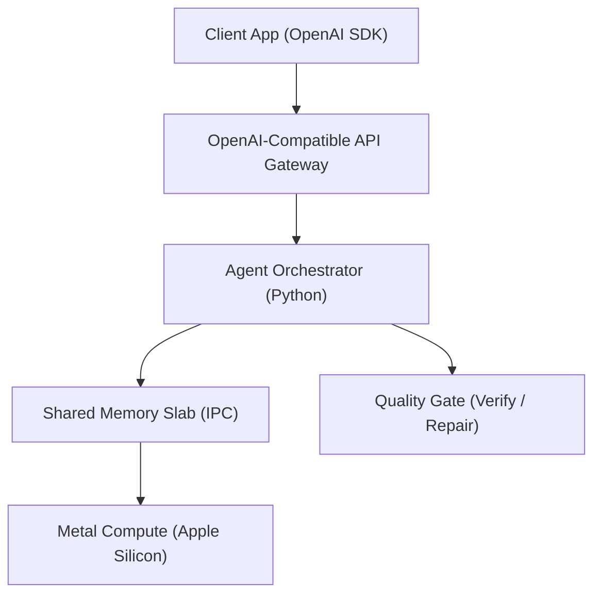

# HiveClaw

**Local, hardware-native inference with an OpenAI-compatible API** — run Llama-class models on Apple Silicon without shipping prompts or coordination state to a cloud provider. Multi-agent workflows share state through **inter-process communication** and **shared-memory orchestration** instead of ever-growing chat transcripts.


> Multi-agent coordination without the **token tax** of shipping full JSON transcripts every round — data stays on device. *Illustrative animation; run [`examples/hiveclaw_top.py`](examples/hiveclaw_top.py) for a live terminal demo.*

[](https://www.gnu.org/licenses/agpl-3.0)
[](https://github.com/wijeratne-a/HiveClaw/actions/workflows/wheel-macos-arm64.yml)
[](https://github.com/wijeratne-a/HiveClaw/actions/workflows/ironclad-burn-in.yml)

## Drop-in API (OpenAI SDK)

Point any OpenAI SDK client at the local server. Swap `base_url` — no other code changes.

```python
from openai import OpenAI

client = OpenAI(base_url="http://127.0.0.1:8080/v1", api_key="local")
resp = client.chat.completions.create(
    model="hiveclaw-llama-1b",
    messages=[{"role": "user", "content": "Summarize this contract."}],
)
print(resp.choices[0].message.content)
```

The server is [`scripts/hiveclaw_server.py`](scripts/hiveclaw_server.py) (packaged as [`hiveclaw_python.openai_server`](crates/hiveclaw-python/python/hiveclaw_python/openai_server.py)).

### Targeted OpenAI API compatibility

HiveClaw implements a **subset** of the OpenAI Chat Completions API — enough for common SDK clients, not a full vendor parity surface.

| Feature | Status | Notes |
|---------|--------|-------|
| `POST /v1/chat/completions` | Yes | Primary endpoint |
| System / user / assistant messages | Yes | String `content` per message |
| `max_tokens`, `temperature`, `stream` | Yes | See server request model |
| SSE streaming (`stream=true`) | Yes | |
| `GET /v1/models` | Yes | |
| Function calling / `tools` | No | Planned |
| JSON mode / `response_format` | No | Planned |
| `POST /v1/embeddings` | No | Out of scope for Phase 1 |

**Note:** When `HIVECLAW_CONTINUOUS_BATCH=1`, the server may require `stream=true` for chat completions (continuous batching path). Default single-request path supports `stream=false` and `stream=true`.

## Why local inference matters

- **Data stays on the machine** — workloads run air-gapped: no third-party API calls, no outbound JSON with your prompts to an external vendor. Ideal for regulated and privacy-sensitive environments.
- **Hardware-native execution** — optimized for **Apple Silicon** and **Metal**; no extra hop through a shared public inference API.
- **Verifiable output** — optional **generate → verify → repair** quality gates ([`scripts/quality_controller.py`](scripts/quality_controller.py)) enforce policy from YAML profiles ([`scripts/quality_profiles/`](scripts/quality_profiles/)) before downstream code trusts model output — the same *verifiable execution* mindset as the **Aegis Protocol**, applied to shipping systems rather than theory.

## Performance (sample committee benchmark)

Synthetic multi-agent task (5 agents × 10 rounds; numbers vary by hardware and model):

| Path | Wall time | Coordination tokens |
|------|-----------|---------------------|
| LangChain string baseline | ~175.6 s | 38 095 |
| HiveClaw local | ~45.8 s | 0 |

Reproduce:

```bash
pip install -r scripts/requirements-bench-langchain.txt
python scripts/benchmark_external.py
```

More harnesses: [`scripts/benchmark_consensus.py`](scripts/benchmark_consensus.py), [`scripts/benchmark_stigmergy.py`](scripts/benchmark_stigmergy.py).

## Architecture (Phase 1) and roadmap

**Phase 1 (current):** Apple Silicon / macOS proof of concept — OpenAI-compatible **API gateway**, Python **orchestration**, **IPC**-backed shared coordination, **Metal** inference, optional **quality gate**.



| Phase | Target | Status |
|-------|--------|--------|
| 1 | Apple Silicon — Metal, macOS IPC | **Shipped** |
| 2 | Linux x86 — POSIX shared memory, Docker | Planned |
| 3 | Multi-node CUDA IPC, NVLink | Planned |
| 4 | vLLM backend integration | Planned |
| 5 | Enterprise auth, audit log, SOC 2-oriented hooks | Planned |

**Implementation internals** (slab layout, compile paths, burn-in criteria): see **[docs/ARCHITECTURE.md](docs/ARCHITECTURE.md)**.

## Quick start

1. Clone the repo and use a single checkout + venv (see [`scripts/README.md`](scripts/README.md)).
2. Build Python extensions and install server deps:

   ```bash
   make python
   pip install -r scripts/requirements-server.txt
   ```

3. Load the IPC broker (macOS): `make daemon-load` — then `make doctor` to verify.
4. Start the API gateway:

   ```bash
   python scripts/hiveclaw_server.py --host 127.0.0.1 --port 8080
   ```

5. Call it with the OpenAI SDK (example above) or `curl` against `/v1/chat/completions`.

**Full setup, models, troubleshooting:** [`scripts/README.md`](scripts/README.md).

### Optional: Python SDK swarm (no raw HTTP)

```python
import hiveclaw_python as hc

swarm = hc.LocalSwarm(model="mlx-community/Llama-3.2-1B-Instruct-4bit")
swarm.add_agent(slot=1, goal="Say hello in one sentence.")
swarm.run()
swarm.stop()
```

Wheels: [`.github/workflows/wheel-macos-arm64.yml`](.github/workflows/wheel-macos-arm64.yml).

| Example | Purpose |
|---------|---------|
| [`examples/hello_swarm.py`](examples/hello_swarm.py) | First run: `LocalSwarm` + optional `--slab-only` |
| [`examples/hiveclaw_top.py`](examples/hiveclaw_top.py) | Side-by-side terminal demo: JSON vs slab timing (`--mock-only` for screen capture) |
| [`examples/local_swarm_catenar.py`](examples/local_swarm_catenar.py) | Verifiable execution (Catenar PoT) |

To replace the hero GIF with a recording of the real TUI: `python examples/hiveclaw_top.py --mock-only` (80×24 terminal, dark theme), then convert with [agg](https://github.com/asciinema/agg) or `ffmpeg`. See [`docs/assets/README.md`](docs/assets/README.md).

## Repository layout

| Path | Role |
|------|------|
| [`crates/hiveclaw-daemon`](crates/hiveclaw-daemon) | **IPC broker daemon** (`pheromoned`) |
| [`crates/hiveclaw-python`](crates/hiveclaw-python) | **Python SDK + OpenAI server** (`hiveclaw_python`, `hiveclaw-server`) |
| [`scripts/`](scripts/) | **Benchmarks, quality gate, demos, burn-in** |
| [`docs/ARCHITECTURE.md`](docs/ARCHITECTURE.md) | **Deep-dive architecture** |

## Licensing

HiveClaw is open-source under the **GNU Affero General Public License v3.0 (AGPL-3.0)**. See [`LICENSE`](LICENSE).

Commercial use where AGPL is not feasible requires a **commercial license**. For inquiries, open a GitHub Discussion or an issue (e.g. label `commercial`), or contact the maintainers through the channel where you obtained the source.
